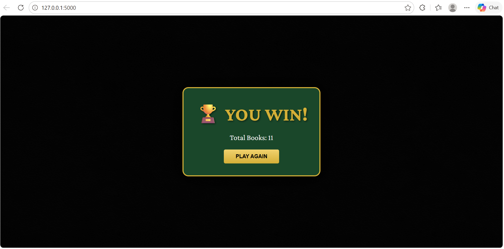

# ♠ Go Phish: Royale Edition ♥

A sophisticated, web-based multiplayer and solo "Go Fish" card game built with **Python Flask** and **Vanilla JavaScript**. This version features a high-end "Casino Royale" aesthetic, fanned card animations, and a "memory-capable" AI opponent.

---

## ✨ Features

* **Rummy-Style UI:** A deep-green felt table with gold accents and a fanned-hand layout inspired by classic casino card games.
* **Solo vs Smart AI:** Play against a "Smart AI" that tracks which ranks you've asked for to make strategic, memory-based moves.
* **Real-time Multiplayer:** Create a table and share the Room ID with friends to play together.
* **No-Scroll UI:** Optimized CSS ensuring that the deck, opponents, and your action buttons stay fixed on the screen at all times.
* **Dynamic Victory Logic:** Automatically calculates winners and displays personalized victory screens (e.g., "COMPUTER WINS!", "PLAYER1 WINS!", or "🏆 YOU WIN!").

---

## 📸 Screenshots

**Main Menu**


**Solo vs AI**


**Multiplayer — Enter Details**


**Multiplayer — Waiting for Players**


**Multiplayer — Live Table**


**Victory Screen**



---

## 🚀 Installation & Setup

### 1. Prerequisites
  Python 3.13.0 

### 2. Clone the Repository
```bash
git clone https://github.com/nishanthrjn/Go_Phish_game
cd Go_Phish_game
```

### 3. Set Up Environment
It is recommended to use a virtual environment:
```bash
# Create venv
python -m venv venv

# Activate venv (Windows)
venv\Scripts\activate

# Activate venv (Mac/Linux)
source venv/bin/activate
```

### 4. Install Dependencies
```bash
pip install -r requirements.txt
```

### 5. Run the App
```bash
python app.py
```

Visit `http://127.0.0.1:5000` in your browser to start the game.

---

## 🛠️ Project Structure
```plaintext
Go-Phish/
├── app.py              # Flask Backend & Game Engine (AI Logic)
├── requirements.txt    # Project Dependencies
├── .gitignore          # Files to exclude from Git
├── templates/
│   └── index.html      # Royale Edition Layout
└── static/
    ├── css/
    │   └── style.css   # Casino Felt Theme & Card Animations
    └── js/
        └── game.js     # Frontend Game Logic & State Management
```

---

## 🤖 Smart AI Memory

The AI in this version is more challenging than a standard random bot.

1. **Memory:** Every time you ask the AI for a card (e.g., "Do you have any 4s?"), the AI saves that rank in its `ai_memory`.
2. **Strategy:** On the AI's turn, it checks its own hand against its memory. If it has a card you previously asked for, it will ask you back for that specific card to complete its "Book."

---

## 📝 License

Distributed under the MIT License. See `LICENSE` for more information.